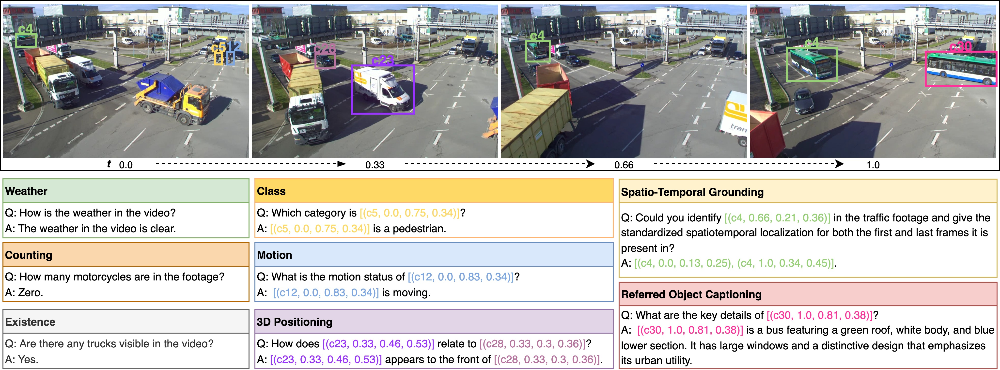

# TUMTraf VideoQA: Dataset and Benchmark for Unified Spatio-Temporal Video Understanding in Traffic Scenes

<p align="center" width="100%">
  
</p>

## Overview

**TraffiX-Qwen** is a multimodal model for traffic video understanding, introduced as the baseline for the **TUMTraf VideoQA** benchmark.  


## Quick Start

### Dataset Structure

Prepare your dataset under `TUMTrafficQA/` as follows:

```text
TUMTrafficQA/
├── raw_videos/
├── QA_type.json
├── trainval.json
├── TUMTraf_ViedeoQAs_train.json
└── TUMTraf_ViedeoQAs_valtest.json
```

### Installation

1. Clone the repository:

```bash
git clone https://github.com/TraffiX-VideoQA/TraffiX-Qwen.git
cd TraffiX-Qwen
```

2. Install dependencies:

```bash
conda create -n traffix python=3.10 -y
conda activate traffix
pip install -r requirements.txt
```

---

## Training

Run training for 0.5B or 7B models:

```bash
bash scripts/TraffixQwen_train_0.5B.sh
# or
bash scripts/TraffixQwen_train_7B.sh
```

---

## Evaluation

### Inference (Multi-GPU or Single-GPU)

Run batch inference on the validation/test set. The script supports multi-GPU by setting `--num-threads` to the number of GPUs you want to use (default is 1 for single GPU).

```bash
python scripts/TraffixQwen_inference_batch.py \
    --model-path ./checkpoints/traffix-qwen-0.5b \  # Path to your trained model
    --data-path TUMTrafficQA/TUMTraf_ViedeoQAs_valtest.json \  # Annotation file
    --video-folder TUMTrafficQA/raw_videos \  # Video folder
    --output results.json \  # Output file
    --batch-size 1 \  # Batch size per process
    --num-threads 1   # Number of GPUs (set >1 for multi-GPU)
```

### Metrics Evaluation

Evaluate the predictions using the official script:

```bash
python eval_tumtraf.py \
    --prediction-path results.json \
    --gt-path TUMTrafficQA/TUMTraf_ViedeoQAs_valtest.json \
    --qa-type-path TUMTrafficQA/QA_type.json
```

---

## Citation

If you find **TraffiX-Qwen** or **TUMTraf VideoQA** useful for your research, we kindly ask you to cite the following work:

```bibtex
@inproceedings{zhou2025tumtraf,
  title={{TUMT}raf Video{QA}: Dataset and Benchmark for Unified Spatio-Temporal Video Understanding in Traffic Scenes},
  author={Xingcheng Zhou and Konstantinos Larintzakis and Hao Guo and Walter Zimmer and Mingyu Liu and Hu Cao and Jiajie Zhang and Venkatnarayanan Lakshminarasimhan and Leah Strand and Alois Knoll},
  booktitle={Proceedings of the 42nd International Conference on Machine Learning (ICML)},
  year={2025},
  url={https://openreview.net/forum?id=Yfoi5O68rf}
}
```

---


## Acknowledgments

**TraffiX-Qwen** is developed based on the strong foundations of open-source projects including:

- [**LLaVA-NeXT**](https://github.com/LLaVA-VL/LLaVA-NeXT)
- [**Qwen2**](https://huggingface.co/docs/transformers/en/model_doc/qwen2)

We gratefully acknowledge the open-source community for their contributions, which have made research in multimodal traffic video understanding possible.